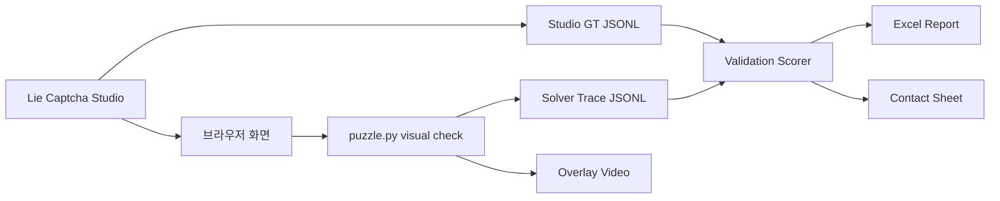

# Studio와 puzzle.py 자동 시각 검증 설계

## 한 줄 정의

Lie Captcha Studio가 만든 새 판을 `puzzle.py`가 실제 마우스 없이 관찰하고, Studio의 정답 경로와 puzzle.py의 선택 표적 경로를 자동 비교하는 검증 시스템을 만든다.

## 구조



## 컴포넌트

### Studio GT Exporter

Studio 내부의 `targetPos(frame)` 결과를 테스트 모드에서 외부로 내보낸다.
기록 단위는 `run_id`, `frame_id`, `target_x`, `target_y`, `canvas_rect`, `shape`, `level`, `seed`다.
이 컴포넌트는 정답을 화면 좌표로 훔치는 장치가 아니라, 사용자가 만든 테스트 스튜디오의 검증용 정답 로그다.

### Puzzle Visual Check Runner

기존 `puzzle.py`의 `--target-visual-check` 흐름을 검증 전용 모드로 고정한다.
마우스 출력은 항상 꺼지고, 후보 검출과 시간축 선택은 그대로 돈다.
선택 표적, 후보 수, 선택 이유, confidence, identity 상태를 매 프레임 남긴다.

### Validation Scorer

Studio 정답 로그와 puzzle 선택 로그를 `frame_id`로 맞춘다.
거리 오차, 성공 여부, 튐 여부, 후보 없음, 신분 상실, 후보 갈아탐을 계산한다.
좌표계가 다르면 `canvas_rect`와 ROI 정보를 사용해 같은 좌표계로 변환한다.

### Report Builder

엑셀에는 run별 요약과 프레임별 상세를 저장한다.
이미지 contact sheet에는 실패 프레임 주변을 모아서 정답과 선택 표적을 같이 표시한다.
영상에는 원본, CCTV 오버레이, 필요 시 3D 흑백 관찰본을 저장한다.

## 데이터 형식

### Studio GT JSONL

```json
{"run_id":"001","frame_id":0,"target_x":640.0,"target_y":480.0,"canvas_rect":[0,0,1280,960],"shape":"star","level":0,"seed":"..."}
```

### Solver Trace JSONL

```json
{"run_id":"001","frame_id":0,"selected_x":642.0,"selected_y":481.0,"candidate_count":18,"confidence":0.92,"reason":"selected_family","mouse_enabled":false}
```

### Score JSONL

```json
{"run_id":"001","frame_id":0,"distance_px":2.2,"passed":true,"fail_reason":""}
```

## 검증 기준

- `mouse_enabled`가 한 프레임이라도 `true`면 해당 run은 실패다.
- Studio GT와 solver trace의 프레임 수 차이가 1프레임을 넘으면 동기화 실패다.
- 성공 판정 거리는 도형 반지름 기반으로 시작하되, 이후 Studio 난이도에 맞춰 조정한다.
- 단순 평균 성공률보다 실패 전환 구간을 더 중요하게 본다.

## 구현 순서

1. 현재 `target_visual_check`가 실제로 마우스 OFF를 끝까지 유지하는지 테스트한다.
2. Studio에 테스트용 GT export 통로를 추가한다.
3. puzzle.py에 검증용 solver trace export를 정리한다.
4. frame_id 기준 채점기를 만든다.
5. 엑셀과 contact sheet 리포트를 만든다.
6. 10회 자동 검증으로 리포트가 정상 생성되는지 확인한다.

## 위험과 대응

- 좌표계가 어긋날 수 있다.
  - 대응은 `canvas_rect`, ROI, 캡처 해상도를 로그에 같이 남기는 것이다.

- 브라우저 렌더링 FPS와 puzzle.py 분석 FPS가 다를 수 있다.
  - 대응은 frame_id와 timestamp를 모두 기록하는 것이다.

- 녹화 파일이 커질 수 있다.
  - 대응은 검증 모드에서 보존 개수와 자동 정리 정책을 둔다.

- 실제 조작으로 오해될 수 있다.
  - 대응은 검증 모드에서 마우스 제어를 코드상 강제로 차단하고 로그에 남기는 것이다.

## 승인 후 작업

이 설계가 맞으면 다음 단계는 구현 계획 작성이다.
구현 계획에서는 수정 파일, 테스트 명령, 리포트 산출물 이름을 구체화한다.
