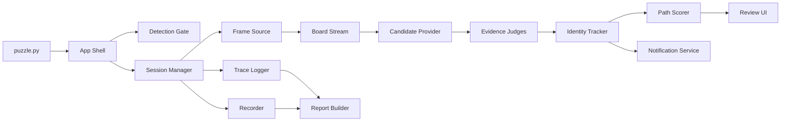
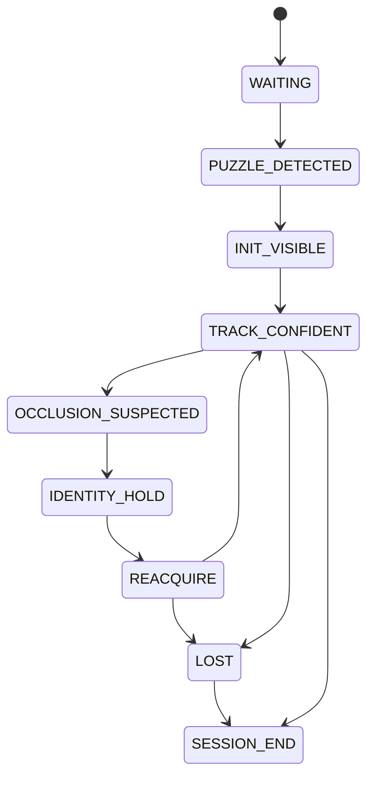

# 투명도형 퍼즐 상세 설계

## 설계 목표

`puzzle.py`는 투명도형 퍼즐을 분석하고 검증하는 전용 콘솔 앱의 진입점이다.

이 앱은 허가된 테스트 퍼즐, 녹화 영상, 이미지 시퀀스, JSONL 로그를 대상으로 동작한다.

핵심 목표는 매 프레임의 최고 후보를 고르는 것이 아니라, 처음 타겟의 신분을 시간축에서 보류하고 복원하는 판별 구조를 만드는 것이다.

## 설계 원칙

탐지와 추적을 분리한다.

후보 생성과 후보 선택을 분리한다.

프레임 단위 판단과 경로 단위 판단을 분리한다.

겹침을 예외가 아니라 상태로 다룬다.

UI 표시는 사람이 이해하기 쉽게 만들고, JSONL 기록은 재현 가능하게 만든다.

녹화, 로그, 텔레그램 알림은 모두 검증 자료를 남기기 위한 운영 계층으로 둔다.

## 상위 구조

## 파일과 책임

초기 구현은 `puzzle.py`를 실행 진입점으로 둔다.

다만 설계상 책임은 아래 단위로 나눈다.

처음에는 같은 파일 안에 클래스로 둘 수 있지만, 코드가 커지면 같은 이름의 모듈로 분리한다.

### `PuzzleApp`

앱 생성, 설정 로드, UI 연결, 종료 처리를 담당한다.

이 클래스는 추적 알고리즘을 알지 않는다.

### `PuzzleShell`

상단 바, 좌측 입력 패널, 중앙 CCTV 화면, 우측 분석 패널, 하단 타임라인, 로그 드로어를 조립한다.

기존 `core_ui/shell.py`의 상단 내비와 로그 드로어 철학을 따른다.

### `DetectionGate`

탐지 영역을 감시하고 퍼즐 출현 이벤트를 만든다.

출력은 `PUZZLE_DETECTED`, `DETECTION_NOISE`, `DETECTION_LOST` 같은 이벤트다.

이 계층은 추적 후보를 만들지 않는다.

### `RoiManager`

게임창 기준 좌표, 모니터 절대 좌표, 퍼즐 프레임 내부 좌표를 변환한다.

탐지 ROI와 퍼즐 ROI를 별도 객체로 관리한다.

ROI가 바뀌거나 창 위치가 달라지면 조용히 보정하지 않고 이벤트로 남긴다.

### `SessionManager`

퍼즐 감지 이후 하나의 분석 세션을 연다.

세션에는 시작 시각, 입력 출처, 게임창 위치, 탐지 ROI, 퍼즐 ROI, DPI, 녹화 파일, trace 파일이 묶인다.

세션은 시작 이후 ROI를 고정한다.

### `FrameSource`

이미지 시퀀스, 영상 파일, 화면 캡처, JSONL replay를 같은 프레임 스트림으로 맞춘다.

UI와 추적기는 입력 종류를 몰라도 된다.

### `BoardStream`

프레임에서 퍼즐 영역 crop을 만든다.

이 crop이 후보 생성, 오버레이, 원본 녹화, trace의 기준 이미지가 된다.

### `CandidateProvider`

YOLO 후보, raw 후보, 보조 후보를 모은다.

이 계층은 후보 recall을 책임진다.

후보 선택은 하지 않는다.

### `EvidenceJudges`

각 후보에 약한 증거를 붙인다.

증거는 배경성, 움직임 독립성, 반복 배경 유사도, 강체 배경 위반, ring/background texture, 색상 보조 신호, 겹침 가능성으로 나눈다.

### `IdentityTracker`

처음 타겟의 신분을 이어받을 path 가설을 관리한다.

가장 가까운 후보를 고르는 것이 아니라, 정체성 상속이 자연스러운 후보 path를 유지한다.

### `OcclusionStateMachine`

겹침, 박스 병합, 중심 밀림, 후보 소실을 상태로 처리한다.

겹침 의심 구간에서는 신분 결정을 보류하고 `IDENTITY_HOLD`로 이동할 수 있다.

### `PathScorer`

후보 하나의 순간 점수가 아니라 path 전체의 설명력을 계산한다.

좋은 path는 시작 anchor, 이동 가능성, 배경성 낮음, 겹침 보류, 분리 후 재획득을 일관되게 설명해야 한다.

### `Recorder`

원본 CCTV 영상, 퍼즐 crop 영상, 오버레이 영상, 스냅샷을 저장한다.

녹화는 추적 성공 여부와 무관하게 세션 시작부터 종료까지 남긴다.

### `TraceLogger`

프레임별 후보, 증거, 상태, 선택, 보류, 재획득, 실패 원인을 JSONL로 기록한다.

나중에 같은 입력으로 replay할 수 있어야 한다.

### `NotificationService`

텔레그램, 경보음, UI 배너를 담당한다.

토큰과 Chat ID는 로그와 리포트에 절대 원문으로 남기지 않는다.

### `ReportBuilder`

세션 종료 후 Markdown 리포트를 만든다.

성공 여부, 평균 오차, 실패 분류, 겹침 횟수, 보류 횟수, 재획득 성공 여부, 녹화 파일 경로를 요약한다.

## 데이터 모델

### `RoiSpec`

탐지 ROI와 퍼즐 ROI를 표현한다.

필드는 `name`, `basis`, `x`, `y`, `w`, `h`, `x_ratio`, `y_ratio`, `w_ratio`, `h_ratio`, `dpi_scale`, `window_title`로 둔다.

`basis`는 `monitor`, `window_client`, `board_frame` 중 하나여야 한다.

### `PuzzleSession`

하나의 퍼즐 분석 실행 단위다.

필드는 `session_id`, `started_at`, `source_kind`, `detect_roi`, `board_roi`, `window_snapshot`, `output_dir`, `recording_paths`, `trace_path`로 둔다.

### `FramePacket`

한 프레임의 공통 포맷이다.

필드는 `session_id`, `frame_index`, `timestamp_ms`, `source_frame`, `board_frame`, `source_kind`, `roi_snapshot`으로 둔다.

### `Candidate`

후보 도형 하나를 표현한다.

필드는 `candidate_id`, `frame_index`, `bbox`, `center`, `score`, `source`, `class_name`, `crop_ref`로 둔다.

`bbox`와 `center`는 항상 퍼즐 영역 내부 좌표로 기록한다.

### `CandidateEvidence`

후보의 판단 근거를 표현한다.

필드는 `candidate_id`, `bg_score`, `motion_divergence`, `rigid_violation`, `phase_similarity`, `texture_bg_score`, `color_residual`, `merge_likelihood`, `notes`로 둔다.

색상 계열 값은 컬러 입력에서만 의미 있게 쓰고, 흑백 입력에서는 낮은 신뢰도로 처리한다.

### `IdentityHypothesis`

처음 타겟의 신분을 이어받는 하나의 path 가설이다.

필드는 `hypothesis_id`, `state`, `last_candidate_id`, `path_points`, `confidence`, `hold_frames`, `reacquire_reason`, `cost_breakdown`으로 둔다.

### `TraceEvent`

JSONL에 남기는 최소 이벤트 단위다.

필드는 `type`, `session_id`, `frame_index`, `timestamp_ms`, `payload`로 둔다.

이벤트 종류는 `session_start`, `detection`, `roi_change`, `frame`, `candidate`, `evidence`, `identity_state`, `selection`, `hold`, `reacquire`, `lost`, `recording`, `notification`, `session_end`로 둔다.

## 상태 전이

## 상태별 의미

`WAITING`은 탐지 영역을 감시하는 대기 상태다.

`PUZZLE_DETECTED`는 탐지 조건이 충족되어 세션을 여는 순간이다.

`INIT_VISIBLE`은 시작 anchor가 명확한 준비 구간이다.

`TRACK_CONFIDENT`는 정체성 가설이 안정적으로 이어지는 구간이다.

`OCCLUSION_SUSPECTED`는 겹침이나 박스 병합이 의심되는 구간이다.

`IDENTITY_HOLD`는 현재 프레임에서 무리하게 정답을 고르지 않고 기존 신분을 보류하는 구간이다.

`REACQUIRE`는 분리 이후 원래 타겟의 신분을 다시 확인하는 구간이다.

`LOST`는 복원 근거가 부족한 실패 상태다.

`SESSION_END`는 녹화, trace, 리포트를 닫는 종료 상태다.

## 탐지 설계

탐지는 퍼즐의 시작 여부만 판단한다.

감지 방식은 타이틀 템플릿, 팝업 형태, 안내 문구, 모델 감지를 조합할 수 있다.

단발 감지는 `DETECTION_NOISE`로 기록한다.

연속 감지가 기준을 넘으면 `PUZZLE_DETECTED`로 승격한다.

탐지 성공 후에는 즉시 세션을 열고 퍼즐 ROI crop 녹화를 시작한다.

탐지 점수는 추적 점수와 섞지 않는다.

## 퍼즐 영역 설계

퍼즐 ROI는 세션 시작 시 고정한다.

모든 후보 bbox, center, overlay, trace는 퍼즐 ROI 내부 좌표를 기준으로 한다.

퍼즐 ROI 밖의 정보는 추적 판단에 직접 쓰지 않는다.

게임창이 움직이거나 DPI가 바뀌면 `ROI_INVALID` 이벤트를 남기고 세션 품질을 낮춘다.

## 후보 생성 설계

후보 생성은 recall 중심으로 설계한다.

YOLO 후보는 기본 후보 pool이다.

raw 후보는 YOLO가 흔들리는 구간의 보조 pool이다.

후보 수가 늘어나면 selector에 부담이 되므로 후보에는 반드시 source와 신뢰 근거를 붙인다.

후보 생성 단계에서 정답을 확정하지 않는다.

## 증거 설계

증거는 하나로 정답을 결정하지 않는다.

각 증거는 약한 신호로 누적한다.

배경성 증거는 후보가 배경 데칼로 설명되는지를 본다.

움직임 독립성은 후보가 배경 흐름과 다르게 움직이는지를 본다.

강체 위반은 전체 배경 정합으로 설명되지 않는 움직임을 본다.

phase 유사도는 한 바퀴 전 배경과 닮았는지를 본다.

texture 점수는 후보 내부와 주변이 배경 무늬에 묶이는지를 본다.

색상 잔차는 컬러 버전에서만 낮은 가중치로 사용한다.

겹침 가능성은 박스 병합, 중심 밀림, 후보 수 변화, 가까운 후보 충돌을 본다.

## 정체성 설계

정체성 판별은 path 중심으로 동작한다.

프레임마다 가장 점수가 높은 후보로 갈아타지 않는다.

현재 후보가 애매하면 기존 신분을 보류한다.

보류 중에는 예측 위치, 가능한 이동 범위, 과거 path, 겹침 맥락을 유지한다.

분리 이후에는 겹치기 전 신분과 가장 자연스럽게 이어지는 후보를 재획득한다.

정체성 스위치는 큰 비용을 가진다.

스위치 비용은 겹침 맥락 없이 발생하면 더 커진다.

## UI 상세 설계

### 첫 화면

첫 화면은 분석 콘솔이다.

랜딩 페이지나 설명 화면을 따로 두지 않는다.

사용자는 바로 입력을 열거나 화면 감시를 시작할 수 있어야 한다.

### 상단 바

좌측에는 앱 이름과 현재 세션 ID를 표시한다.

중앙에는 입력 출처, 프레임 번호, FPS, 현재 상태를 표시한다.

우측에는 녹화 상태, 텔레그램 상태, ROI 상태를 표시한다.

### 좌측 패널

좌측 패널은 입력과 설정만 담당한다.

버튼은 이미지 시퀀스 열기, 영상 열기, JSONL replay 열기, 화면 감시 시작, ROI 설정, 녹화 폴더 열기로 둔다.

탐지 ROI와 퍼즐 ROI는 서로 다른 섹션으로 보여준다.

### 중앙 CCTV

중앙은 가장 크게 둔다.

원본 보기, 오버레이 보기, 분할 보기 모드를 제공한다.

오버레이에는 후보 박스, 선택 path, 보류 구간, 겹침 의심, 재획득 후보를 표시한다.

후보 색상은 의미별로 고정한다.

선택 path는 녹색, 보류는 노란색, 겹침 의심은 주황색, 실패는 빨간색, 배경성 높은 후보는 회색으로 둔다.

### 우측 패널

우측 패널은 판단 근거를 보여준다.

상단에는 현재 상태와 정체성 신뢰도를 둔다.

중단에는 선택 후보의 cost breakdown을 둔다.

하단에는 최근 이벤트와 실패 가능성 경고를 둔다.

숫자만 보여주지 않고 짧은 자연어 설명을 함께 둔다.

### 하단 타임라인

하단 타임라인은 프레임 이동과 원인 분석의 핵심이다.

겹침 구간, 보류 구간, 재획득 구간, 실패 구간을 색 막대로 표시한다.

클릭하면 중앙 CCTV와 우측 판단 근거와 로그가 같은 프레임으로 이동한다.

### 로그 드로어

로그는 기본적으로 접혀 있다.

카테고리 칩은 입력, 탐지, ROI, 후보, 증거, 정체성, 겹침, 재획득, 녹화, 알림, 오류로 둔다.

전체 로그는 JSONL에 남기고, 화면에는 요약 로그만 보여준다.

## 녹화 설계

녹화는 세션 단위로 자동 시작한다.

원본 CCTV 녹화는 입력 프레임 그대로 저장한다.

퍼즐 crop 녹화는 추적 판단 기준이 된 보드만 저장한다.

오버레이 녹화는 설명용으로 저장한다.

스냅샷은 감지 시점, 겹침 시작, 보류 시작, 재획득, 실패 순간에 저장한다.

녹화 파일과 trace 파일은 같은 session_id를 공유한다.

## 텔레그램 설계

텔레그램은 운영 알림만 담당한다.

알림 종류는 퍼즐 감지, 녹화 시작, 겹침 장기화, 재획득 실패, 세션 종료, 리포트 생성으로 둔다.

알림에는 원본 토큰이나 민감 설정을 포함하지 않는다.

알림 과다 발송을 막기 위해 세션별 쿨다운을 둔다.

실패 알림에는 원본 전체 화면보다 퍼즐 crop 스냅샷을 우선 첨부한다.

## 산출물 구조

세션 산출물은 `03_output/YYYY-MM-DD_투명도형퍼즐_sessions/session_id` 아래에 저장한다.

원본 녹화는 `raw_cctv.mp4`로 둔다.

퍼즐 crop 녹화는 `board_crop.mp4`로 둔다.

오버레이 녹화는 `overlay.mp4`로 둔다.

trace는 `trace.jsonl`로 둔다.

요약 리포트는 `report.md`로 둔다.

스냅샷은 `snapshots` 폴더에 둔다.

## 검증 기준

1차 기준은 16개 GT replay다.

2차 기준은 기존 무손실 녹화 replay다.

3차 기준은 새 랜덤 테스트 퍼즐 녹화다.

성공은 종료 위치만으로 판단하지 않는다.

성공은 정체성 스위치 없이 처음 타겟 신분을 유지했는지로 판단한다.

실패는 반드시 원인 분류를 가진다.

실패 원인은 검출 누락, 후보 선택 실패, 박스 내부 중심 복원 실패, 겹침 중 신분 전환, 분리 후 재획득 실패, 배경 데칼 오판, ROI 무효 중 하나로 둔다.

## 우선순위

1순위는 세션, ROI, 녹화, trace의 뼈대를 만드는 것이다.

2순위는 replay 입력과 CCTV 화면을 안정화하는 것이다.

3순위는 후보와 증거를 UI에 투명하게 보여주는 것이다.

4순위는 정체성 상태머신을 붙이는 것이다.

5순위는 텔레그램과 리포트를 연결하는 것이다.

## 구현 전 결정사항

`puzzle.py`는 앱 진입점으로 둔다.

추적 알고리즘은 UI에 직접 들어가지 않는다.

탐지 ROI와 퍼즐 ROI는 세션 시작 시 별도로 고정한다.

모든 좌표는 어떤 좌표계인지 명시한다.

모든 세션은 원본 녹화와 trace를 남긴다.

알림 토큰과 Chat ID는 로그, 리포트, 스냅샷에 남기지 않는다.
